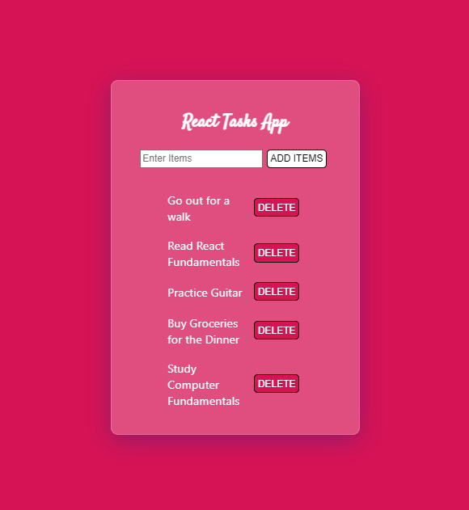

## Task List app written in React JS

Very basic web app written in React, takes the form input from the user and renders the contents in form of a list, user can also delete specific list items.

Demo : https://bespoke-stardust-7ec8bb.netlify.app/

## Concepts learnt in this project

### useState Hook
### preventDefault()
### handleSubmit() 
### onChange() 
### onClick() 
### UUID package
### map function for looping throught the list
### filter function for displaying deleted content
